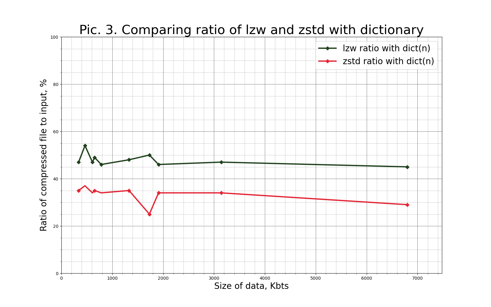
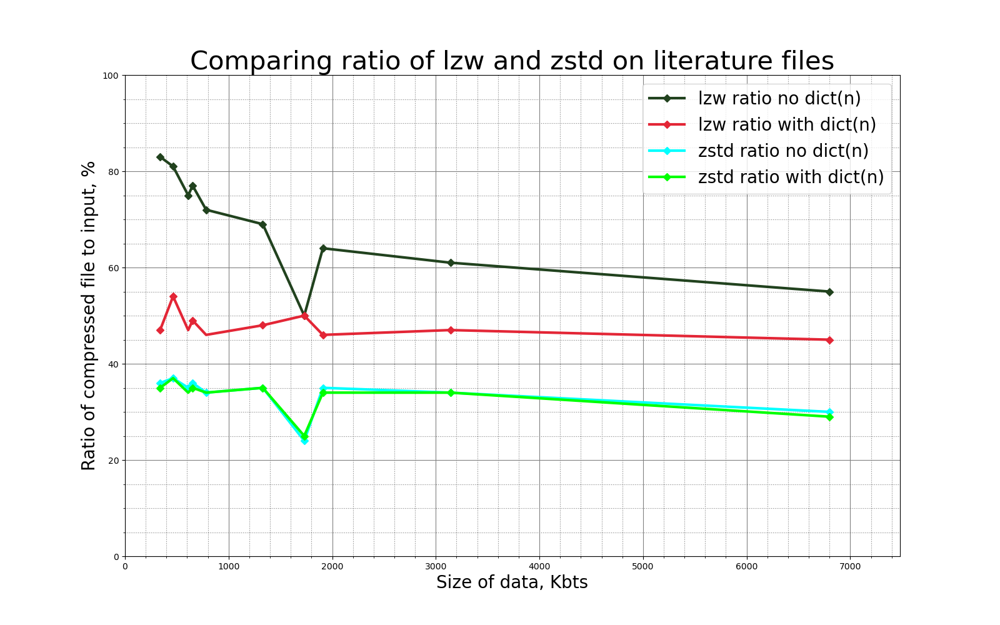
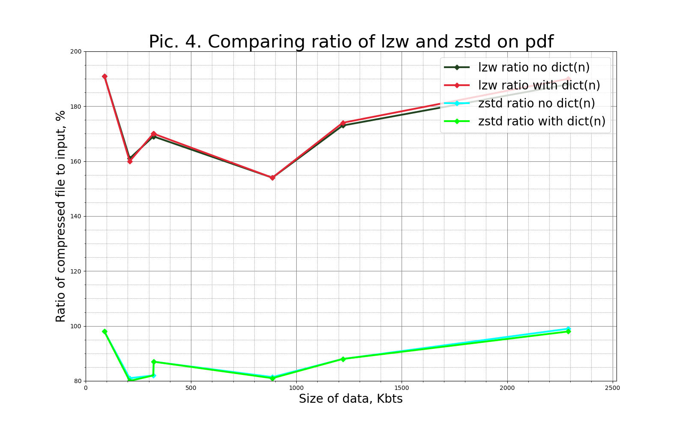

# LZW compressor with trained dictionary

Required programs:

- Cmake version  3.21
- Boost 1.40 program_options

# Install
```
> mkdir build
> cmake ..
> make

```

# Run lzw
```
> mkdir build
> cmake ..
> make
> ./lzw -k [source] [-o destination]

```

# Run unlzw
```
> mkdir build
> cmake ..
> make
> ./unlzw -k [source] [-o destination]

```

## Examples of commands
```
> ./lzw --train true -maxdict=10000  -k ../samples/bin_samples/ -o dict.txt
> ./lzw -f  -D dict.txt -k test.dat -o  ../lzw/dat.lzw
> ./unlzw -k compressed.lzw -o dest.decode

```

### Main options:

```-k [--keep]```   **To scecify source dir**  $\newline$

```-o [--OUTPUT]``` **To scecify destination dir** $\newline$

```--train true```  **To create dictionary(output specification is neccessery available in compress mode), ***SAMPLE SOURCE IS DIRECTORY WRITTEN THIS WAY: dir/***** $\newline$

```-D [--dict]``` **To specify dictionary for compressor(available in compress mode)** $\newline$

```--maxdict``` **To scecify max size of dictionary** $\newline$


# Tests

## There is e2e testing and unit_testing

Required programs:

- Python
- Google tests


### How to run end to end tests that check quality of compression and check sha1hash?
Run this command from build directory
```
> python ../tests/end_to_end_tests/e2e_tests.py

```

### How to run end to end tests compare zstd and lzw compressing?
Run this command from build directory
```
> python ../tests/end_to_end_tests/compress_runner.py

```


---
<h1 align="center">Comparison of LZW and ZSTD compressors</a></h1>


<h2 align="center">Classic literature files compression without dictionary</a></h2>

<p align="center">
  
</p>

### We can see thar then bigger size of input then better compression of lzw compressor


<h2 align="center">Classic literature files compression with dictionary</a></h2>

### In this point algorithm of creating dictionary was coded and I got these results after testing. Max dictionary size was equal to 100000 elems. You can find dictionaries in directory "./tests/end_to_end_tests/my_dictionary/"


<p align="center">
  
</p>

<p align="center">
  
</p>

### Finally I represented previous data on one graph. For lzw and zstd we can that see results of compression with dictionary improved dramaticly on small data(less then 500Kbts).

<p align="center">
  
</p>

<h2 align="center">PDF files compression</a></h2>

<p align="center">
  
</p>

### According to graph we can make a conclusion that zstd and lzw algorithms are bad for compressing of PDF files

<h2 align="center">BIN files compression</a></h2>

<p align="center">
  
</p>

# Conclusion:

### Taking into consideration all mentioned above we can make a conclusion that lzw compression algorithm is good for compression of small data. Results of compression increase sharply if generated dictionary is added.

## Difference between data deduplication and trained dictionary

### Is a method for eliminating duplicate copies of duplicate data. While reading of data scaner search for element. In the deduplication process, unique pieces of data are identified and stored during the analysis process. As the analysis continues, other fragments are compared to the array wtih stored copy, and when a match occurs, the redundant fragment is replaced with a link pointing to the stored copy in data array. Usually uses with big data: with huge file directories.

### Algorithms based on trainned dictionary search within a specific buffer of a single file (“sliding window”) and creates dictionary using data that was read from single file.
